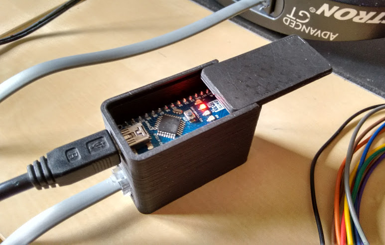

# NexStar Controller

A USB controller for [Celestron](https://www.celestron.com/collections/astronomy)
telescopes using the NexStar AUX protocol.

## Description

This is a USB controller for Celestron NexStar AUX protocol implemented in Arduino.
It substitutes the hand controller, receiving the commands from the PC (HC procotol)
and communicating with the mount (AUX protocol).

Documentation on the NexStar HC and Aux protocols:

 * [NexStar HC Protocol](http://www.nexstarsite.com/download/manuals/NexStarCommunicationProtocolV1.2.zip)
 * [NexStar AUX Protocol](http://www.paquettefamily.ca/nexstar/NexStar_AUX_Commands_10.pdf)

## Features

 * Get/set location and time
 * Sync
 * Goto (equatorial and horizontal coordinates)
 * Tracking on/off
 * Meridian flip
 * Above-the-horizon limit

TODO:

 * RTC support
 * Homing switches
 * Hibernate/wakeup
 * Support for South hemisphere
 * Support for alt-az mounts

## Limitations

Currently, only equatorial mounts in the North hemisphere are supported.

## Required libraries

 * [Time](https://github.com/PaulStoffregen/Time)
 * [AccelStepper](https://github.com/waspinator/AccelStepper.git)

The library AstroLib, wich is part of this project, must be installed in the
Arduino libraries directory.

## Compiling

The provided Makefile requires [Arduino-Makefile](https://github.com/sudar/Arduino-Makefile)
to work. In Debian/Ubuntu/Mint, you can install it with

    sudo apt install arduino-mk

If you downloaded `Arduino-Makefile` to a custom location (other than
`/usr/share/arduino`), you must indicate the correct directory by modifying
the `ARDMK_DIR` variable in the `Makefile.avr` or `Makefile.sam`.

The code can be compiled and uploaded to the Arduino board using

    make
    make upload

Of course, you can also program the Arduino board using the Arduino IDE.

### Compiling for Arduino Due

Download the toolchain for SAM boards using the Boards Manager in the Arduino IDE.

Comment the line `include Makefile.avr` and discomment the line
`include Makefile.sam` in the `Makefile`.

## Schematics

## Enclosure

The CAD directory contains an STL model of the enclosure I use, which was
created with openSCAD. It requires an Arduino Nano and a small prototype
board. The resistor, the diode and the modular connector shown in the
schematics are mounted in the prototype board.
